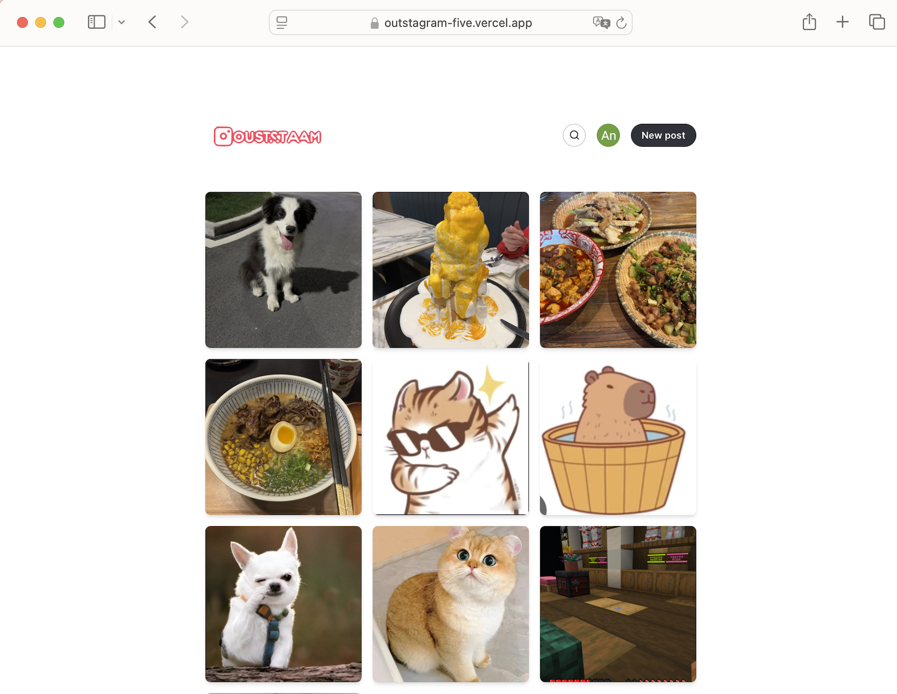
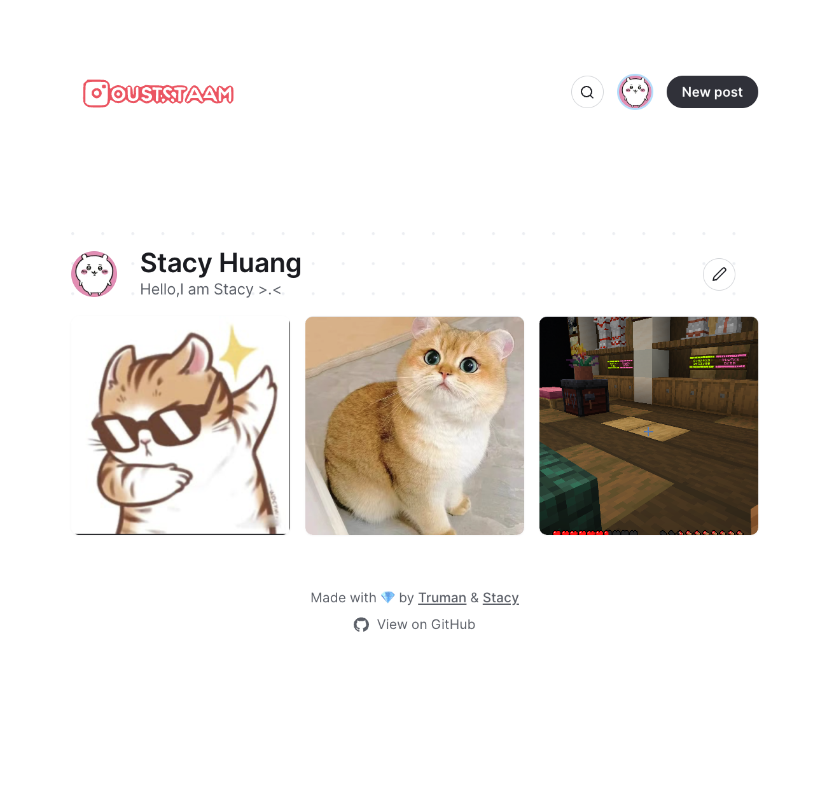

Outsagram is a simple tool that allows people to share pictures and photo, but for small groups only. Features include a simple **Markdown-based** post editor with preview, **image upload**, comments and likes, **search**, a beautiful gird psot layout with **dark mode support**. Offer three login method with github, google and facebook.





## Setup

### Install dependencies

```bash
npm install
```

### Create a database

- Create a [connection string](https://planetscale.com/docs/concepts/connection-strings#creating-a-password) to connect to your database. Choose **Prisma** for the format
- Set up the environment variables:

```bash
cp .env.example .env
```

- Open `.env` and set the `DATABASE_URL` variable with the Database address
- Create the database schema:

```bash
npx prisma db push
```

### Configure authentication

GitHub, Google and Facebook authentication settings are available and needed to set in .env.
Register API token from each provider and set in .env
Including:
- GITHUB_ID=
- GITHUB_SECRET=
- GITHUB_ALLOWED_ORG=""
- GOOGLE_CLIENT_ID=
- GOOGLE_CLIENT_SECRET=
- FACEBOOK_CLIENT_ID=
- FACEBOOK_CLIENT_SECRET=


### Enable image uploads

To enable image uploads, set the environment variable `NEXT_PUBLIC_ENABLE_IMAGE_UPLOAD` to `true`.

Outstagram uses Cloudinary for storing uploaded images. You can [sign up for a free account](https://cloudinary.com/users/register/free).

- On your Cloudinary dashboard, look for these values under your account settings: **Cloud Name**, **API Key**, **API Secret**.
- Update `.env` with the following variables:
  - `CLOUDINARY_CLOUD_NAME`: **Cloud Name**
  - `CLOUDINARY_API_KEY`: **API Key**
  - `CLOUDINARY_API_SECRET`: **API Secret**

## Running the app locally

```bash
npm run dev
```

Open [http://localhost:3000](http://localhost:3000) in your browser.


## 🙏 Acknowledgements

This project is built upon the amazing work done in [Beam](https://github.com/planetscale/beam) by [PlanetScale](https://planetscale.com/). Huge thanks to the team for open-sourcing such a well-crafted and inspiring codebase. I’ve used it as a foundation and made custom modifications to suit my own use case.

